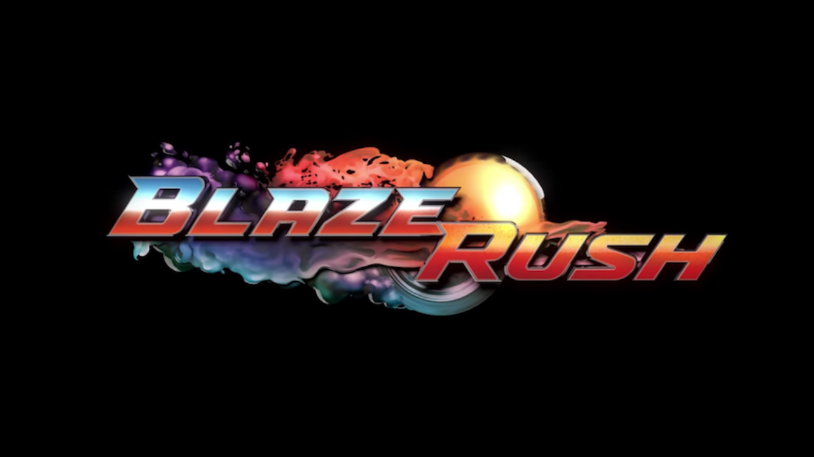

<a name="readme-top"></a>


<!-- PROJECT LOGO -->
<br />
<div align="center">
  <a href="https://github.com/github_username/repo_name">
    
  </a>

<h3 align="center">Projet Blaze Rush</h3>

  <p align="center">
    Projet de Master 1 en spécialité développement logiciel et jeux vidéo.
    <br />
    <br />
  </p>
</div>


<!-- TABLE OF CONTENTS -->
<details>
  <summary>Sommaire</summary>
  <ol>
    <li>
      <a href="#a-propos">A propos</a>
      <ul>
        <li><a href="#les-livrables">Les livrables</a></li>
      </ul>
    </li>
    <li>
      <a href="#livrables-techniques">Livrables Techniques</a>
      <ul>
        <li><a href="#physique-des-véhicules">Physique des véhicules</a></li>
        <li><a href="#physique-des-bonus">Physique des bonus</a></li>
        <li><a href="#gestion-input,-camera-et-ordre">Gestion Input, Camera et Ordre</a></li>
        <li><a href="#installation">Installation</a></li>
      </ul>
    </li>
    <li>
      <a href="#livrables-écrits">Livrables écrits</a>
    </li>
    <li>
      <a href="#contacts">Contacts</a>
    </li>
  </ol>
</details>


<!-- ABOUT THE PROJECT -->
## A propos

Le but de ce premier semestre était de réaliser différents prototypes et documentations techniques afin de bien définir le projet pour sa future réalisation au deuxième semestre.

<p align="right">(<a href="#readme-top">back to top</a>)</p>


### Les livrables

* Un cahier des charges
* Le détail des fonctionnalités complexes à implémenter
* Un diagramme UML des classes du jeu
* Le détail d'une solution technique pour implémenter l'IA
* Prototype de la physique des véhicules
* Prototype de la physique des bonus
* Prototype de la gestion des Input
* Prototype de la gestion de la caméra
* Prototype de la gestion du joueur le plus proche de l'arrivé

<p align="right">(<a href="#readme-top">back to top</a>)</p>


<!-- GETTING STARTED -->
## Livrables Techniques

Nous avons créé différents projets Unity afin de bien segmenter les prototypes. 

### Physique des véhicules

Le dossier `Proto_Car` regroupe toutes les fonctionnalités de la voiture sur un circuit lambda.
<br>
Il suffit de connecter un controller et de se déplacer à l'aide du joystick de gauche.
<p align="right">(<a href="#readme-top">back to top</a>)</p>

### Physique des Bonus

Le dossier `Proto_Bonus` regroupe toutes les fonctionnalités des 2 types de bonus, attaque et défense. 2 bonus sont activables, le boost léger et la mitraillette.
<br>
Il suffit de connecter un controller, ramasser les bonus rouges et bleues en se déplaçant avec le joystick de gauche et d'appuyer sur le bouton de gauche pour booster et le bouton d'en bas pour tirer, peu importe la manette utilisée. 
<p align="right">(<a href="#readme-top">back to top</a>)</p>

### Gestion Input, Camera et Ordre

Le dossier `Proto_Camera_Input_Order` regroupe toutes les fonctionnalités des 3 derniers prototypes demandés. 
<br>
Il suffit de connecter des controllers, d'appuyer sur le bouton du bas pour sauter et / ou se connecter puis de se déplacer avec le joystick pour voir apparaitre différentes sphères que la caméra suit. 
<br>
Pour lancer la course, il faut aller dans Unity, le GameObject `_Scripts` et cocher la variable `RaceStarted`.
<p align="right">(<a href="#readme-top">back to top</a>)</p>

### Installation

1. Cloner le repo git
   ```sh
   git clone https://github.com/Herowynn/Project_BlazeRush.git
   ```

2. Ouvrir les différents dossier depuis Unity Hub
   ```sh
   Proto_Car
   Proto_Bonus
   Proto_Camera_Input_Order
   ```

3. Installer les packages si nécessaires
   ```sh
   InputSystem
   Probuilder
   ```

<p align="right">(<a href="#readme-top">back to top</a>)</p>


<!-- USAGE EXAMPLES -->
## Livrables écrits

Pour ce qui est des livrables écrits il y a :
* `cdc_blaze_rush.pdf` qui correspond au cahier des charges avec le détails des fonctionnalités complexes à implémenter
* `solution_ia.pdf` qui correspond à la solution technique pour implémenter l'IA
* `UML_Project_Blaze_Rush.drawio` qui correspond à l'UML détaillant les différentes classes du jeu

<p align="right">(<a href="#readme-top">back to top</a>)</p>


<!-- CONTACT -->
## Contacts

Rémy - Chef de projet & Développeur - `Herowynn (Rémy)#6704`<br>
Armand - Développeur - `Jambon#3656`<br>
Bastien - Développeur- `boby#3949`<br>
Hugo - Développeur - `Kova#1311`<br>
Alexis - Développeur - `AlexisS#4987`

<p align="right">(<a href="#readme-top">back to top</a>)</p>

